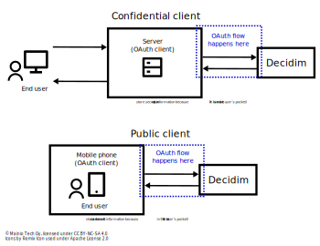

# Decidim API examples for 3rd party participant applications

This repository contains examples of 3rd party participant applications for
interacting with the Decidim API and the OAuth authentication flows in order to
use the Decidim API as a signed in user.

The purpose of these examples is to show how to implement the OAuth
authentication flows and how these flows work in code. Another purpose for these
examples is to validate that the designed authentication functionality would
work for the designed use cases. The example applications are not meant to be
used in production and they should be used for educational purposes only.

For actual production applications, you should always use ready-made software
libraries that are already tested and widely used for implementing the OAuth
authentication flow within your application. You should always avoid writing
your own authentication layer as you most likely end up creating bugs and
decreasing the security of your users. We are sure that these examples also
contain bugs.

These examples call the Decidim API only to demonstrate that the authentication
actually works and the API recognizes the user as an actual signed in user. The
goal is not to do anything too complicated with the API but to focus on
demonstrating how the OAuth flow works and how the received authentication token
can be used when calling the API.

## How to integrate?

In order to integrate the Decidim OAuth authentication to your
participant-facing application, you should learn about OAuth and PKCE. Useful
resources include:

- https://datatracker.ietf.org/doc/html/rfc6749
- https://oauth.net/2/pkce/

In case you want to implement a machine-to-machine integration with Decidim
where the machine itself acts as a user in Decidim, you should use the "API
Credentials" section in Decidim's `/system` panel to setup a machine user for
the application. Such machine users should be only used for applications that
run outside of the user space, i.e. applications that are not used directly by
participants. Such applications could include, for example, automations that
need to update data in Decidim automatically based on content available in an
external system.

### Never ask users to provide their credentials to external systems

Users' personal credentials (e.g. their email and password) should never leave
the application that serves as the authentication authority (in this case,
Decidim). The user should always authenticate against the Decidim service itself
and authorize these external 3rd party applications to perform certain actions
on behalf of them utilizing the provided authentication token that is issued
after a successful authentication and authorization through OAuth.

This means that any application integrating with the Decidim API should never
ask the user's credentials directly but rather send the user to authenticate
themselves inside Decidim and provide authorization for the application to act
on behalf of them. Otherwise you are increasing the possibility of the user's
credentials getting into the wrong hands and therefore decreasing their security
and privacy.

Authentication credentials should only live at the service that knows how to
validate them and map them to the correct user. This also means that any
application other than the originating authentication authority for the
credentials should be considered a security thread. The authentication authority
should be in control of which applications are granted the possibility to
request authorization from the authority's users.

### Types of participant-facing applications

There are two types of applications or "OAuth clients" that can be integrated
with the Decidim OAuth authentication:

- **Confidential** which means that the authentication process is handled by an
  application that is not in the hands of the actual end user. This is the most
  typical use case for web applications that have a server and HTML-based user
  interface running in a web browser.
- **Public** which means the application handling the authentication is
  literally in the hands of the end user, such as a native mobile application.

The difference between these two types of applications is how the authentication
flow is handled, as public clients cannot store any confidential information,
such as client secrets which would be required to perform the OAuth
authentication flow under normal conditions. Therefore, we need an alternative
strategy for handling the authentication flow.

The following image shows the differences between these two types of
applications or "OAuth clients":



The main difference is that public clients cannot store any confidential
information (e.g. client secret) because the user can access this information.
Even if the confidential information is never shown to the user, this type of
information cannot be embedded into any software code that is literally in the
user's pocket. This means that technically savvy users are able to access this
information in case they reverse engineer the software they have the code for,
even when it is in compiled format.

### OAuth authentication flow

The authentication flow works as follows for external applications:

- The user asks the external application to authenticate themselves.
- The application (i.e. the "OAuth client") sends the user to perform an
  authorization request in Decidim.
- The user provides their authentication credentials to Decidim or alternatively
  uses one of the configured authentication providers within Decidim.
- The user is shown a page that asks them to authorize access to their account
  for the requesting application (i.e. the "OAuth client").
- User accepts the authorization.
- User is sent back to the application (i.e. the "OAuth client") with a valid
  authorization code.
- The application (i.e. the "OAuth client") requests for an authentication token
  from Decidim using the received authorization code.
- Decidim issues an authentication token for the user that can be used for
  further calls to Decidim as a signed in user.

With confidential applications or "OAuth clients", the authorization step is
skipped in case there is already a valid token for the same resource owner, i.e.
the authenticating user. The same valid token will be returned without the
authorization in case the user has already authorized the application and the
token is still valid. Public clients will always require the user to
re-authorize the application to perform actions on their behalf.

### Proof Key for Code Exchange (PKCE, pronounced "pixy")

The application that we want to integrate with (Decidim) utilizes the
[Doorkeeper gem](https://doorkeeper.gitbook.io/) that provides the
[PKCE flow (RFC 7636)](https://datatracker.ietf.org/doc/html/rfc7636) for safer
public client authorizations. This prevents the CSRF attack vector for public
clients performing the authorization. Read more about Doorkeeper and PKCE at:

https://doorkeeper.gitbook.io/guides/ruby-on-rails/pkce-flow

https://oauth.net/2/pkce/

The PKCE flow is already enabled for Decidim, so you can utilize it with no
configuration changes at the Decidim side.

While the PKCE was designed to prevent the attack vector with public clients,
there is nothing wrong implementing it with the confidential clients either. In
fact, it is often recommended to use PKCE even when the client secret based
authentication, which would be confidential OAuth clients.

Implementing PKCE adds a bit of implementation overhead but you should primarily
look into ready-made software libraries that already implement it. With
confidential clients, using PKCE is optional but recommended. Both of these
options are fine as long as your client is confidential. With public clients,
you should always use PKCE.

If you are unsure whether your application is confidential or public, you can
assume it is public and use PKCE without the client secret. When setting up the
OAuth application at Decidim, you also need to define whether the application is
confidential or public.

### Calling the API

The API key returned to from the OAuth `/token` endpoint is in the JSON Web
Token (JWT) format in case the API scopes were requested during the OAuth
authorization step. It means that the token contains the following information
in JSON format when base64 decoded:

```json
{
  "access_token": "abcdef",
  "token_type": "Bearer",
  "expires_in": "7200",
  "scope": "profile user api:read",
  "created_at": 1748860445
}
```

From this information, you need the values of `token_type` and `access_token` in
order to form a valid authorization string. Combine the values of `token_type`
and `access_token` separated with a space character so that the resulting string
looks as follows:

```
Bearer abcdef
```

Another detail you need to add to the API requests is a custom header with the
name `X-Jwt-Aud` that indicates the audience of each request, i.e. which
application is calling the API. The value of this header should match the OAuth
application's (or client's) ID that you can find from the Decidim `/system`
panel. This is an extra detail required for the API calls because of the way the
tokens are issued at Decidim.

This will be the value that is expected by the Decidim server within the
`Authorization` header of the HTTP request. You can use it to make calls to the
Decidim GraphQL API with the following types of HTTP requests:

```
POST /api HTTP/1.1
Accept: application/json
Authorization: Bearer abcdef
Content-Length: 53
Content-Type: application/json
Host: localhost:3000
User-Agent: Dummy API Client
X-Jwt-Aud: OAUTH_CLIENT_ID

{"query":"{ session { user { id name nickname } } }"}
```

In case the access token works correctly, you should receive a response with
details about the session for the logged in user. In case the token is invalid,
you will receive a `null` response within the `session` field of the response.

## Example applications

This repository provides two separate example projects for demonstrating how the
OAuth flow can be implemented for different types of applications:

- [Native Android application](./examples/android-flutter/) serving as an
  example of a public OAuth client implementation.
- [Node.js web application](./examples/web-nodejs/) serving as an example of a
  confidential OAuth client implementation.

For web a web developer, the easier example is obviously the Node.js example
which is a traditional web application written mostly in JavaScript. It is super
easy to get started with in case you want to try these applications out. The
native mobile application requires some setup work that may take a while in case
you are doing it for the first time and are not generally working with native
mobile applications.

Both applications work similarly from the user's perspective. The difference is
in how the OAuth authentication flow is handled.

## License

The code in this repository is unlicensed because we do not want anyone to use
this code as-is. The examples are meant to educate you and to see how the API
authentication is designed to work. You should invest time into learning how to
implement the authentication for your application and you should always rely on
ready-made software libraries for the authentication flows. These examples are
for educational purposes only.
