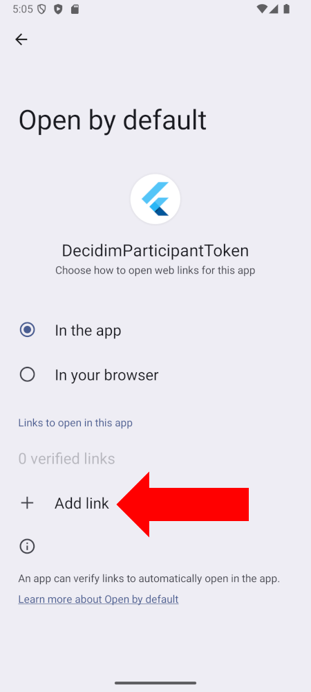
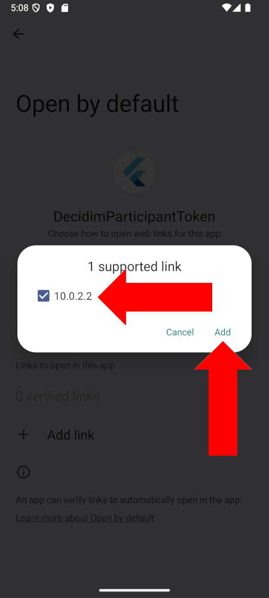
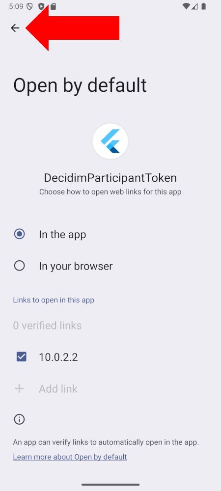
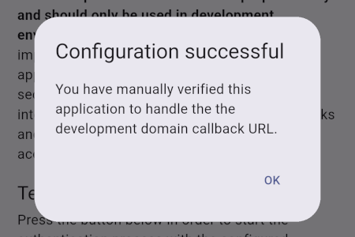
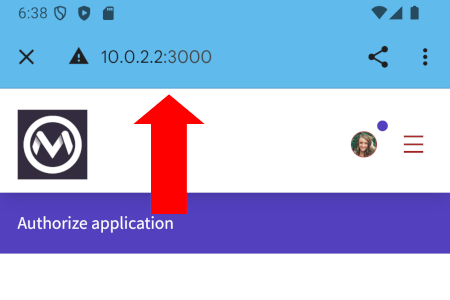
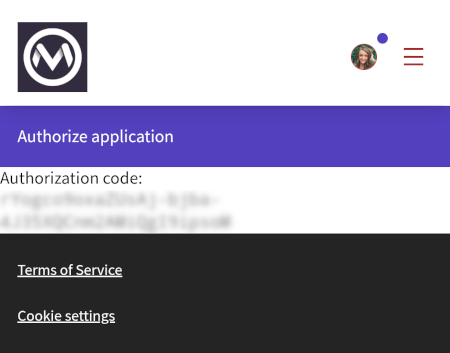

# Decidim Participant Token for Android

This is an example Android application that serves as an example of a **public**
OAuth client interacting with the Decidim API as an authenticated participant.
It is written with [Flutter](https://flutter.dev/). Note that the implementation
only supports Android, there is no support for iOS. There is also a bit of
native Android code written in Kotlin in order to handle the authentication
process specifically to the Android platform, as there are currently no built-in
interfaces within the Flutter framework to handle these types of situations.

The goal is to show how this type of **public** client integration could be
implemented in a way that can be relatively easily understood by web developers.
The application is not built for long-term maintenance and its main target
audience for this example are web developers interacting with the Decidim
software.

The integration would be very similar on any other platform, such as iOS, but
there are slight differences between these platforms and how to handle the
platform specific parts, i.e. the interaction between the native application and
the browser:

- On Android, the authentication process is handled within a
  [Trusted Web Activity](https://developer.android.com/develop/ui/views/layout/webapps/trusted-web-activities)
  and the authorization code is passed back to the application using an intent
  filter that passes the authentication redirect URI back to the application for
  getting the authorization code back to the native app.
- On iOS, the authentication process is handled within a
  [web authentication session](https://developer.apple.com/documentation/AuthenticationServices/ASWebAuthenticationSession)
  and the authorization code is passed back to the application using a callback
  scheme that is configured for the authentication session.

For further information on how to handle OAuth authorization flows in native
apps, please refer to [RFC 8252](https://www.rfc-editor.org/rfc/rfc8252). The
bottom line is that the user's personal credentials should not be directly
passed to the application (e.g. by having a username and password field embedded
within the application) and rather the authorization should happen within a
browser that passes the authorization code back to the native app.

The dependencies are kept to the bare minimum in order to show all the relevant
business logic for such integrations within this example. For actual production
applications, we would recommend relying on an existing and well-established
OAuth integration library to perform the authentication logic. Ideally on any
platform, you should be primarily looking into using ready made, widely used,
and tested software libraries for handling authentication related workflows. The
whole authentication process is built into this application without such
dependencies as this application is demonstrating how the integration works as a
whole.

## Why we picked Flutter for this example application?

The best possible user experience and performance can only be achieved by
building an actual native application specific to each platform. In the past, we
have tested several frameworks for building cross-platform mobile applications
(including React Native, NativeScript, Ionic, and Cordova/PhoneGap) and the
bottom line is that all of these frameworks have several issues with their
development tooling as well as application performance. Documentation can be
also limited with some of these platforms making it harder to work with them.

Flutter is a breath of fresh air in this space because:

- It provides a real native application runtime for the Dart code running most
  of your application's business logic and runs the application really close to
  the speed of fully native applications (the whole codebase is actually
  compiled to native code on each platform, without any bridges).
- It encourages the developer to write the fully native parts of the application
  as actual native code, which is the best way to do it.
- The UI components are native, as you would expect from a modern cross-platform
  development kit, so they also perform well and are in line with the
  platform(s) you target your application to run on.
- Dart is an approachable and relatively easy language for developers coming
  from the web development world.
- The development tooling is really solid and works well with very little
  problems. This includes live reloading which works really well when modifying
  any Dart code. Full restarts are only necessary when modifying fully native
  parts of the application (in the case of Android, the Kotlin or Java code).
- The documentation is really good and there are plenty of examples available
  to guide forward with any problems. It was also extremely easy to get started
  with Flutter once all the necessary installation and setup was done (which
  takes some time and similar steps with any of these frameworks).
- The framework does not instantly want to drive you away from mobile app
  development after working with it for a couple of days, as we have experienced
  with all the JS-based cross-platform development frameworks.

Flutter is not perfect either but it is definitely the best we have experienced
from the available cross-platform framework options. It is a nice balance
between developer productivity and the performance of the application which is
sufficient for most typical apps. Better yet, if you need more performance, you
can always write those parts in fully native code and integrate them easily with
the Flutter code. Do not blindly believe in the false promises of automatic
cross-platform support of any of these frameworks, as with most applications,
you will end up writing at least some amount of native code as well, targeted to
each individual platform. Even as simple application as this one required
writing native code.

## Preparation

Note that the Android emulator requires quite a lot of resources from your
machine, so it is recommended to have at least 32GB of memory available on your
machine as well as several CPU cores available in order to allocate some of them
to the emulator and leave some of them for the Decidim server and other tools
running on your machine. It is also recommended not to have any other programs
running on the machine consuming resources while trying out the application
within an emulator. Close e.g. all unused browser tabs and windows before
running the emulator for the smoothest development experience.

These instructions are written for Ubuntu but feel free to apply them to your
preferred environment. Each of the tools provide targeted guidance for different
operating systems.

### Install JDK in case not already installed

You need an up-to-date version of JDK installed on your machine, for example
JDK 21. You check which version you have installed by running:

```bash
$ java --version
$ javac --version
```

If you do not have an up-to-date version, please installed it by running the
following command, for example:

```bash
$ sudo apt install -y openjdk-21-jdk
```

### Install Android Studio and configure it

1. [Download Android Studio](https://developer.android.com/studio)
   * It is not necessary to use Android Studio but you will need the tooling it
     provides, most importantly the command line utilities as these are needed
     for the further steps. You can also only install the command line tools
     only if you feel you do not need Android Studio.
2. Follow the installation instructions
3. After installation, add the following to your terminal environment variables,
   on Ubuntu to `~/.bashrc`:
```
# Android
export ANDROID_HOME="$HOME/Android/Sdk"
export PATH="$PATH:$ANDROID_HOME/platform-tools:$ANDROID_HOME/cmdline-tools/latest/bin"
alias android-emulator="$ANDROID_HOME/emulator/emulator"
```
4. Run the following command in order to install the necessary SDK packages
   (some of these may be already installed in case you installed Android
   Studio):
```bash
$ sdkmanager --install 'build-tools;36.0.0' 'cmdline-tools;latest' 'emulator' \
  'platform-tools' 'platforms;android-36' \
  'system-images;android-36;google_apis;x86_64' \
  'ndk;26.3.11579264'
```

### Create a virtual emulator device for the targeted API

Run the following command to create a virtual device (adjust the configurations
to your liking and your system environment, alternatively you can also use the
Virtual Device Manager in Android Studio):

```bash
$ avdmanager create avd -n Medium_Phone_API_36 -d medium_phone -c 512M \
  --path ~/.android/avd/Medium_Phone.avd \
  --abi x86_64 --package 'system-images;android-36;google_apis;x86_64'
```

### Test the virtual device

Test that the virtual device starts correctly within the emulator by running:

```bash
$ android-emulator -avd Medium_Phone_API_36
```

After the device boots and starts as expected, you can stop it by running
`CTRL+C` within the same terminal you used to start it.

### Install Flutter tooling

Follow the manual installation guide for Flutter:

https://docs.flutter.dev/install/manual

Basically what is required is to download the Flutter SDK, extract the package,
agree on the required software licenses, run `flutter doctor` to see any
possible issues with your installation and fix those issues in case there are
any.

As instructed by the guide, make sure to verify that the environment is
correctly setup by running:

```bash
$ flutter doctor
```

## Configuration

In order to use a trusted web activity within the application required for the
authentication process, the application needs to be signed and the signing
keystore needs to be paired with the web application. This requires a bit of
configuration for the application and the Decidim server prior to running it.

### Generate a keystore for the Android app

Within the project folder, run the following commands:

```bash
$ mkdir .keystore
$ keytool -genkey -v \
  -keystore .keystore/local.keystore \
  -alias local \
  -keyalg RSA \
  -keysize 2048 \
  -validity 10000 \
  -dname "CN=Example, OU=Development, O=Mainio Tech, L=Helsinki, ST=Uusimaa, C=FI" \
  -storepass 123456
```

### Configure the keystore for the application

Within the project folder, run the following command:

```bash
echo -e "storePassword=123456\nkeyPassword=123456\nkeyAlias=local\nstoreFile=$(pwd)/.keystore/local.keystore" > android/key.properties
```

This creates a file named `android/key.properties` and adds the necessary
contents to that file for the build process. This file referenced at
`android/app/build.gradle.kts` to fetch the information about the key store for
the release build.

### Configure the Decidim server

> [!NOTE]
> This step should be done in case the Decidim is running in a publicly
> available domain under HTTPS. In case you are running the application locally
> without tunneling to a public domain, you do not need to do this. This guide
> assumes you are doing this locally but in case you want to try how it should
> ideally work with automatic domain validation, you should follow this with
> some tunneling solution applied.

If you want to run the development application under an actual domain, as you
would for production applications, you will need a public web server associated
with the domain you want to test the integration with. The simplest way is to
setup a temporary nginx server serving static files from the `public` folder of
your application. The Decidim application can be run locally on your machine and
under HTTP, as long as the `assetlinks.json` is served from a public HTTPS
domain with the default 443 port.

This would be the ideal situation, as then you could automatically get the
application's callback URL verified with Google. Otherwise, you will need to
manually verify the domain within the emulator device (instructions further down
in this documentation).

In order to create the `assetlinks.json`, do the following.

Get the keystore SHA256 fingerprint:

```bash
$ keytool -list -v -keystore .keystore/local.keystore -storepass 123456 | grep SHA256 | sed 's/\s*SHA256: \(.*\)/\1/'
```

Within the **Decidim instance**, create the following file:

```bash
$ mkdir -p public/.well-known
$ touch public/.well-known/assetlinks.json
```

Add the following contents to that file with an editor:

```json
[
  {
    "relation": ["delegate_permission/common.handle_all_urls"],
    "target": {
      "namespace": "android_app",
      "package_name": "fi.mainiotech.decidimparticipanttoken",
      "sha256_cert_fingerprints": ["PLACE THE SHA256 FINGERPRINT HERE"]
    }
  }
]
```

This file should be accessible under from the following URL publicly:

`https://www.yourdomain.org/.well-known/assetlinks.json`

You do not need to run the whole Decidim application under that domain in case
you only want to test the authentication integration. Only this file needs to be
served from that domain and under HTTPS.

### Run the Decidim server

For the application to be able to connect to Decidim, compile the assets and run
the Decidim server:

```bash
$ bundle exec ./bin/shakapacker
$ bundle exec rails s
```

### Configure an icon for a valid manifest.json in Decidim

Within the Decidim administration panel, go to Settings -> Appearance. In that
view, upload a suitable icon to the "Icon" section under "Edit layout
appearance" and save the settings.

After configuration, within a Chrome browser, go to the front page of the
application and open the developer console. Open the Application tab and select
the "Manifest" section on the left side panel. Under the "Error and warnings"
section, check that there are no significant errors presented. You can ignore
the warnings stating "Richer PWA install UI won't be available on ...".

After validated, you should see the PWA install button within the Chrome
browser's URL bar:


After this, the application should be recognized as a PWA and we should be able
to start a trusted web activity within the application considering all other
configurations have been implemented correctly.

### Configure the OAuth application for Decidim

Within the Decidim's `/system` panel, go to "OAuth applications" and create a
new application with the following details:

- **OAuth Application Name**: Public Android example
- **Application type**: Public
- **Redirect URI**: `http://10.0.2.2:3000/oauth/authorize/native`
- **Organization**: Example corp
- **Organization URL**: https://www.example.org
- **Organization logo (square)**: (add any image)
- **Available scopes**: `profile`, `user`, `api:read`

### Configure Decidim to be served from the correct domain

Within the emulator, the IP address `10.0.2.2` is pre-configured to point back
to the host machine. Therefore, you can run the Decidim organization within this
host but you need to configure it by running the following command within the
**Decidim instance**:

```bash
$ bundle exec rails runner 'Decidim::Organization.first.update!(host: "10.0.2.2")'
```

In case you use a public domain, obviously you should configure that as the host
of your organization.

### Configure the environment variables

Copy the `.env.example` file as `.env` at the root of this project and add the
OAuth client ID to that file from the Decidim `/system` panel. Note that the
example configuration assumes you are running Decidim locally on the same
machine where the Android emulator is running. In this case, the address
`10.0.2.2` at the emulator is pointing back to the host machine.

### Create a signed build and run in within the emulator

Start the Android emulator with the following command (considering you have
followed the prior instructions on setting this up):

```bash
$ android-emulator -avd Medium_Phone_API_36
```

Run the release build on the emulator:

```bash
$ flutter run --dart-define-from-file=.env --release
```

In case you have previously installed the app with a different signing key, you
may get an error when the application is installed. Flutter handles this
situation automatically by uninstalling the previous version and installing the
latest version but if you for some reason need to uninstall the app manually,
you can do that by running the following terminal command:

```bash
$ adb uninstall fi.mainiotech.decidimparticipanttoken
```

### Manually verify the callback URL for the application

> [!NOTE]
> This step is necessary if you run Decidim under the local development domain,
> i.e. `10.0.2.2` within the emulator (pointing back to the host machine). If
> you run Decidim under a public domain and under HTTPS, you can skip this step.

Since the development domain `10.0.2.2` is not available for the public
internet, we need to manually configure the application to open the callback URL
by default on the device regardless of the prior configuration, since Google is
not able to verify the domain from the host machine's loopback address as it is
not a public domain. With a normal production domain, this step would not be
needed as Google would automatically verify the domain and associate it with the
application from a publicly accessible URL.

Run the following command to open the correct settings view within the emulator:

```bash
$ adb shell am start -a android.intent.action.VIEW \
  -c android.intent.category.BROWSABLE \
  -d "http://10.0.2.2:3000/oauth/authorize/native?verify=1" \
  fi.mainiotech.decidimparticipanttoken
```

Within the settings screen, click "+ Add link":



Select `10.0.2.2` from the list, and click "Add":



Once done, go back to the application with the back arrow button:



Verify that the domain is enabled by the user by running the following command:

```bash
$ adb shell pm get-app-links --user cur fi.mainiotech.decidimparticipanttoken
```

The output should look similar to this with the domain `10.0.2.2` enabled:

```
  fi.mainiotech.decidimparticipanttoken:
    ID: 00000000-0000-0000-0000-000000000000
    Signatures: [YOUR KEYSTORE FINGERPRINT]
    Domain verification state:
      10.0.2.2: 1024
    User 0:
      Verification link handling allowed: true
      Selection state:
        Enabled: <-- !!!
          10.0.2.2
```

Finally, you can test that the application is handling the callback URL
correctly by running the following command **without the package name**:

```bash
$ adb shell am start -a android.intent.action.VIEW \
  -c android.intent.category.BROWSABLE \
  -d "http://10.0.2.2:3000/oauth/authorize/native?test=1"
```

You should see the following success message on the screen:



Note that when the domain is not properly verified by Google, the in-app browser
experience will show the browser bar at the top of the view:



This bar is removed if the domain is correctly verified by Google and the
application will show up in full screen mode for a better integrated user
experience during the authentication process. This is impossible to achieve
without having the domain available to the public and served under HTTPS. In
order to get rid of the in-app browser bar, you should first ensure that the
test for your digital asset links statements succeeds at:

https://developers.google.com/digital-asset-links/tools/generator

If the test is successful and you still see the app bar, please clear the
browser cache on the mobile device, restart the application and and retry after
that.

## Testing the application

Once everything is configured and works as expected, you can start testing the
application. Later on, you can run the following commands to test the
application.

Android emulator:

```bash
$ android-emulator -avd Medium_Phone_API_36
```

Build and run the Flutter application (in release mode in order to sign the
application with the configured signing keys):

```bash
$ flutter run --dart-define-from-file=.env --release
```

Decidim server (within the Decidim instance):

```bash
$ bundle exec rails s
```

Start the authentication process by clicking the button on the application's
initial view. An in-app browser will open to guide you through the Decidim OAuth
authorization process and the authorization code is used to fetch an
authentication token for accessing the Decidim APIs as a signed in user.
Finally, the application does a simple request to the API utilizing this token
in order to demonstrate that the authentication actually works as expected.

In case your application is not correctly setup, you may see the following
screen after a successful login and authorizing the application at Decidim:



In this case, please read this guide through and follow all the configuration
steps. The application is not configured correctly to handle the redirect
callback URL and cannot therefore receive the OAuth authorization code from
Decidim.

## Notes about this implementation

This implementation is done for demonstrational purposes and it should not be
utilized as-is for actual production applications. There are several software
libraries that implement the OAuth authorization flow that are widely used,
actively maintained and well tested in actual implementations.

This project implements the whole OAuth authorization flow in order to
demonstrate how the integration works as a whole. It is not meant to be used as
a basis for such implementations but rather to show what should happen during
the OAuth authorization.
